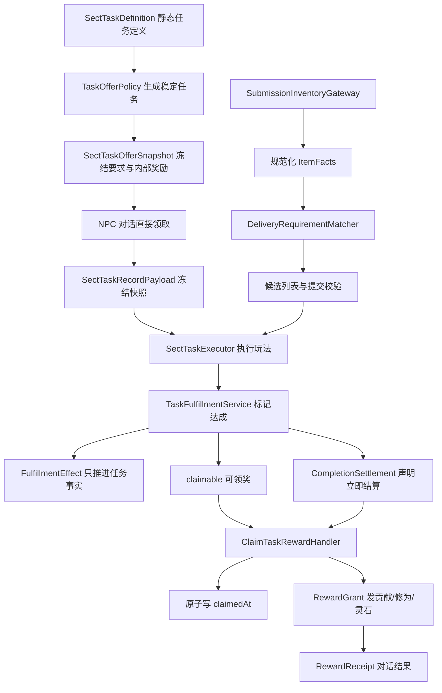
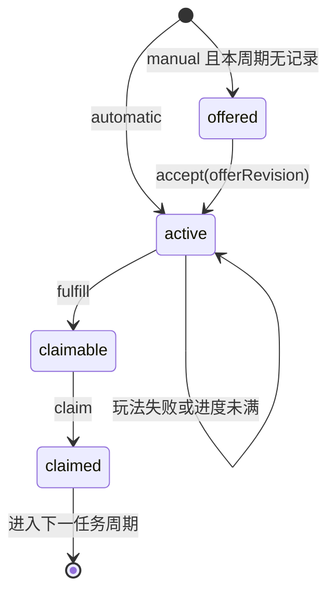

# 宗门委托与任务结算重构设计稿

## 1. 文档状态

- 状态：设计定稿，已纳入事务堂房间与 NPC 会话重构
- 日期：2026-07-25
- 分析基线：2026-07-25 当前工作区
- 适用范围：宗门日常、周常、悬赏、晋升试炼、任务战斗、清扫与灵矿采掘玩法、道具交付和任务奖励结算
- 主要入口：`/game/sect/affairs`
- 目标：作为后续宗门任务重构的实施依据

本文只设计宗门组织玩法中的任务系统，不替换通用 `TaskService`，不重做 battle-v5、炼丹、炼器、市场或玩家状态总架构。

## 2. 已确认产品决策

### 2.1 场景与交互

1. 宗门事务页表现为一个由文字、排版和少量 CSS 构成的房间，不引入额外美术资源。
2. 日常、周常、晋升事务分别由值日执事、功簿执事和传功长老办理，全部任务经 NPC 对话进入。
3. NPC 用一句开场白说明当前可接、办理中和待交回的事务；玩家选项只保留一句自然回应，不展示类型、周期、难度、期限或状态卡片。
4. 对话选项本身就是领取任务或交回回执的最终动作，不再打开二次确认弹窗。
5. 战斗、清扫和进度任务达到目标后进入“可领奖”状态；道具交付在永久移交确认后直接结算奖励。
6. 需要场景执行的任务仍要求玩家回到宗门事务页复命；道具交付不再额外要求一次回执操作。
7. 领取前不展示奖励种类或数值；领取成功后在当前 NPC 对话中展示实际到账的宗门贡献、修为和灵石。

### 2.2 日常次数

“今日委托不限制次数”的准确规则为：

- 每日没有“只能选一个日常”的总量限制。
- 每个日常任务定义每天最多领取并完成一次。
- 同一天可以依次向值日执事接办全部日常。
- 不允许同一个任务在同一天无限重复刷取。

数据库现有唯一约束 `(membership_id, period_key, task_id)` 保留，作为“每任务每周期一次”的最终防线。

### 2.3 道具需求

1. 丹药、法宝和材料交付使用统一的“交付需求 + 候选物品 + 服务端匹配”模型。
2. 需求由服务端确定，客户端不得自行解释或生成要求。
3. 需求不能依赖道具名称、描述文本或手写运行时标签。
4. 丹药需求读取 `consumables.spec`。
5. 法宝需求读取 `wanjiedaoyou_creation_products` 及其持久化 `product_model`，不持久化或依赖 `battleProjection`。
6. 高价值物品的交付数量默认固定为一件；难度主要来自品质和复合条件，不靠堆数量制造消耗。

### 2.4 境界与品质

1. 炼气期要求范围为凡品至灵品。
2. 筑基期要求范围为灵品至玄品。
3. 从金丹期开始，最低要求统一为玄品。
4. 随境界提升只提高可抽取的品质上限，要求上限最高为仙品。
5. 高境界不能稳定或频繁要求仙品；仙品只是低概率上限。
6. 高境界的额外难度优先由复合属性条件承担，不继续抬高品质下限。
7. 系统永远不会要求“神品及以上”，但玩家仍可主动提交超过最低要求的物品。

### 2.5 奖励

1. 标准日常和周常奖励均可包含宗门贡献、修为和灵石。
2. 奖励由境界基础值、任务定义和最终需求难度共同决定。
3. 奖励在任务领取时冻结为快照，之后突破境界或调整配置都不改变已领取任务的奖励。
4. 奖励不根据玩家实际提交物品超出要求的部分继续增加，避免误交和套利。
5. 晋升试炼可继续只授予晋升资格，不强制套用标准货币奖励。

## 3. 设计目标与非目标

### 3.1 目标

1. 建立清晰、可验证的任务生命周期。
2. 将“任务达成”和“奖励发放”彻底分离。
3. 让任务要求、候选物品和拒绝原因对玩家透明。
4. 让随机需求可复现、不可刷新重掷、可版本化。
5. 让需求生成、物品匹配、奖励计算和 UI 展示各自只有一个职责。
6. 保留现有宗门 executor、settlement、progress 和前端 renderer 注册机制的扩展方向。
7. 普通新宗门继续复用标准组织玩法，不需要复制任务服务或事务页。
8. 所有物品消耗、任务状态和奖励发放保持在同一玩家状态事务中。

### 3.2 非目标

- 不把宗门任务合并进通用 `TaskService`。
- 不重写通用背包、炼丹、炼器或市场页面。
- 不新增平行的道具表、法宝表或任务表。
- 不让 LLM 决定需求品质、奖励数值、物品资格或经济结果。
- 不为本次重构修改 battle-v5 的战斗结算模型。
- 不在事务堂房间中重建完整角色面板或完整背包。
- 不在第一阶段引入任务刷新券、放弃任务、重掷或付费重置。

## 4. 现状梳理

### 4.1 当前任务定义

标准任务定义位于：

- `src/shared/engine/sect/core/organization/StandardSectOrganizationModule.ts`
- `src/shared/engine/sect/core/organization/contracts.ts`

当前标准目录包含五个日常、三个周常和一个晋升试炼：

- 日常：清扫山门、巡视矿场、灵矿采掘、丹药委托、法宝委托
- 周常：勤务周录、宗门小比、悬赏令
- 晋升：长老试炼

`SectTaskDefinition` 当前同时包含：

- 静态展示文案
- executor key
- contribution reward
- completion settlement rules
- progress strategy
- availability policy

其中 `completion` 同时承担任务后续进度、贡献、修为和灵石结算，导致“达成”和“领奖”无法分开。

### 4.2 当前生命周期

当前持久化状态只有：

```text
active -> completed
```

前端派生状态为：

```text
offered | active | completed | locked
```

任务 executor 返回 `completed: true` 后，`ProcessSectTaskCompletionHandler` 会：

1. 将任务记录更新为 `completed`。
2. 立即发布 `SectTaskCompleted`。
3. 执行贡献、修为、灵石和进度信号等全部 completion rule。

因此当前没有“已达成但未领奖”这一状态。

### 4.3 当前每日互斥

`GetSectTasksQueryHandler` 会查找当天任意一条 daily record，并将其他日常设置为不可用。

领取时 `ExecuteSectTaskActionHandler` 又通过 `findDaily()` 做第二次互斥校验。

该限制与新的“每日每项一次、总数不限”规则直接冲突，必须同时移除查询层和命令层判断，不能只改 UI。

### 4.4 当前奖励

标准日常实际上已经包含：

- 宗门贡献
- `calculateSceneCultivationExp('daily_task', ...)` 计算出的修为
- 按境界阶数计算的灵石

但 `presentation.rewardSummary` 只展示贡献，完成结果也只显示“卷宗已经更新”。当前主要问题是：

- 奖励发放时机错误。
- 奖励摘要不完整。
- 结果不可见。
- 周常和日常的奖励策略不统一。

### 4.5 当前道具交付故障

当前 UI 的 `ItemDeliveryAction` 读取：

- `useInventorySnapshot()`
- `useProductsSnapshot()`

但 PlayerState 的 `loadout` 只包含技能、功法、法宝和装备状态；`selectActiveCultivatorProfile()` 明确将 `consumables` 和 `materials` 组装为空数组。因此：

- 丹药下拉框可能始终为空。
- 材料下拉框可能始终为空。
- 法宝只能获得很薄的展示事实。

即使有候选物品，当前 UI 也只展示名称、品质、数量，不展示服务端隐藏要求。服务端丹药 executor 却会按 seed 要求 `healing` 或 `mana` family，所以玩家只能在提交后才知道不符合。

### 4.6 当前持久化条件

`wanjiedaoyou_sect_task_records` 已有：

- `status`
- `progress`
- `payload jsonb`
- `completed_at`
- `claimed_at`

但当前 `SectTaskRecord`、`mapTask()` 和 repository port 没有传递 `claimedAt`，也没有领取奖励的 repository 方法。

这意味着本次设计无需为“是否领奖”新增列，但必须：

- 将 `claimedAt` 纳入领域记录。
- 增加原子 claim 更新。

### 4.7 当前可保留的扩展点

以下现有结构应继续复用：

- 服务端 `SectTaskExecutorRegistry`
- 服务端 `SectTaskSettlementRegistry`
- 服务端 `SectTaskProgressRegistry`
- `SectOrganizationPluginManifest`
- 前端 `SectTaskRendererRegistry`
- 通用 action endpoint： `/api/sects/current/tasks/:taskId/actions/:actionKey`
- `commitPlayerStateMutation()` 事务、幂等和状态版本机制

本次重构应补充扩展点，不应退回按 task id 写 `if/switch` 的页面或路由。

## 5. 目标架构



依赖方向必须保持：

```text
React 展示
  -> shared contracts
  -> Hono route
  -> application handler
  -> domain policy / port
  -> repository / transaction adapter
```

禁止方向：

- UI 复制需求匹配公式。
- repository 依赖 React 或展示文案。
- shared task core 直接读取数据库 row。
- task requirement matcher 依赖 battleProjection。
- 普通宗门内容模块复制标准任务服务。

## 6. 核心模型

### 6.1 静态任务定义

建议将 `SectTaskDefinition` 调整为：

```ts
interface SectTaskDefinition {
  id: SectOrganizationTaskId;
  kind: 'daily' | 'weekly' | 'promotion';
  enrollment: 'manual' | 'automatic';
  requiredCapability: SectCapabilityKey;
  executorKey: SectTaskExecutorKey;
  availability?: SectTaskAvailabilityPolicy;
  offer?: SectTaskOfferPolicyDefinition;
  reward?: SectTaskRewardPolicyDefinition;
  fulfillment: readonly SectTaskFulfillmentRule[];
  completionTags?: readonly string[];
  progress?: SectTaskProgressDefinition;
  target: number;
  presentation: SectTaskPresentationDefinition;
}
```

字段职责：

- `enrollment`：是否需要玩家领取。
- `offer`：如何生成本周期稳定要求，不负责发奖。
- `reward`：如何计算和冻结奖励，不负责判断任务是否完成。
- `fulfillment`：任务达成后需要发布的进度事实，不包含货币发放。
- `executorKey`：如何执行玩法，不负责生成经济奖励。

字段调整：

- 当前 `completion` 中的 contribution 和 realm daily reward 移到 `reward`。
- 当前 progress signal 移到 `fulfillment`。
- 当前 `contributionReward` 移入 reward policy input。
- `presentation.rewardSummary` 改为动态快照生成，不再存固定贡献文案。

### 6.2 领取方式

建议配置：

| 任务             | enrollment  |
| ---------------- | ----------- |
| 五个日常         | `manual`    |
| 宗门小比、悬赏令 | `manual`    |
| 勤务周录         | `automatic` |
| 长老试炼         | `automatic` |

原因：

- 日常和可主动执行的周常由对应 NPC 提供明确的领取选项；选择后立即执行。
- 勤务周录依赖整周累计事实，不能因玩家晚点开页面而丢失进度。
- 长老试炼是永久晋升门槛，不需要按周期领取。

自动任务仍然需要手动领奖；`automatic` 只跳过领取，不跳过领奖。

### 6.3 稳定任务快照

未领取任务由服务端派生：

```ts
interface SectTaskOfferSnapshot {
  schemaVersion: 1;
  rulesVersion: number;
  offerRevision: string;
  anchorRealm: RealmType;
  anchorRealmStage: RealmStage;
  periodKey: string;
  executorKey: SectTaskExecutorKey;
  requirement?: SectDeliveryRequirement;
  difficulty: DailyTaskDifficulty;
  reward: SectTaskRewardSnapshot;
}
```

`offerRevision` 用于领取时并发校验，不作为安全凭证。它至少覆盖：

- rulesVersion
- membershipId
- taskId
- periodKey
- anchorRealm
- requirement
- reward snapshot

revision 从上述字段的规范化序列化结果计算，计算输入不包含 `offerRevision` 自身。服务端不接受客户端回传 snapshot 后再做哈希。

客户端领取时只回传 `offerRevision`，不回传可被信任的 requirement 或 reward。

### 6.4 持久化 payload

领取后将告示快照冻结：

```ts
interface SectTaskRecordPayload {
  schemaVersion: 1;
  target: number;
  offer: SectTaskOfferSnapshot;
  executorData: Record<string, unknown>;
  completionData?: {
    submittedItem?: SectSubmittedItemSnapshot;
    submittedItems?: SectSubmittedItemSnapshot[];
  };
}
```

规则：

- `offer` 领取后不可修改。
- executor 只能修改 `executorData`。
- 单件交付成功后写入最小 `submittedItem` 审计快照；组合材料交付写入 `submittedItems`，并继续兼容旧记录。
- 不允许 executor 在 payload 顶层随意添加字段。
- 每次读取和写入都通过 Zod 解析，不直接强制类型转换 JSONB。

### 6.5 视图状态

数据库继续只存：

```text
status = active | completed
claimedAt = null | timestamp
```

前端状态统一派生：

| 条件                        | view state  |
| --------------------------- | ----------- |
| 无记录，权限不足            | `locked`    |
| 无记录，manual，可领取      | `offered`   |
| active                      | `active`    |
| completed 且 claimedAt 为空 | `claimable` |
| completed 且 claimedAt 非空 | `claimed`   |

`completed` 不再作为前端最终状态名，避免混淆“已经达成”和“已经结清”。

### 6.6 生命周期



禁止转换：

- offered 直接 claim
- active 直接 claimed
- claimable 再次执行任务
- claimed 再次发奖
- 同一周期为同一 task definition 创建第二条记录

## 7. 随机需求设计

### 7.1 生成原则

1. 使用纯函数和稳定 seed。
2. seed 至少包含：

```text
membershipId : taskId : periodKey : rulesVersion
```

3. 不使用当前背包内容参与生成，避免“系统只要我已经有的东西”以及通过转移物品操纵结果。
4. 不使用 `Math.random()`。
5. 不复用 battle random 或 creation-v2 内部随机工具，避免跨领域依赖；在宗门任务 offer policy 内提供窄的 deterministic random source。
6. 生成器只从经过审查的模板池组合要求，不实现任意 JSON 表达式 DSL。
7. 刷新、重新登录和重复 GET 必须得到相同告示。
8. 领取后以后续持久化快照为准。

### 7.2 品质范围和初始权重

下表中的品质是“任务最低要求”的抽取范围，不是限制玩家只能提交该品质。

| 大境界 | 最低要求范围 | 建议初始权重                                    |
| ------ | ------------ | ----------------------------------------------- |
| 炼气   | 凡品～灵品   | 凡品 70%，灵品 30%                              |
| 筑基   | 灵品～玄品   | 灵品 70%，玄品 30%                              |
| 金丹   | 玄品～真品   | 玄品 75%，真品 25%                              |
| 元婴   | 玄品～地品   | 玄品 55%，真品 30%，地品 15%                    |
| 化神   | 玄品～天品   | 玄品 45%，真品 30%，地品 18%，天品 7%           |
| 炼虚   | 玄品～仙品   | 玄品 40%，真品 28%，地品 18%，天品 11%，仙品 3% |
| 合体   | 玄品～仙品   | 玄品 35%，真品 28%，地品 20%，天品 13%，仙品 4% |
| 大乘   | 玄品～仙品   | 玄品 30%，真品 27%，地品 22%，天品 16%，仙品 5% |
| 渡劫   | 玄品～仙品   | 玄品 25%，真品 25%，地品 23%，天品 20%，仙品 7% |

硬约束：

- 金丹及以上不得生成凡品或灵品要求。
- 任何境界不得生成神品要求。
- 仙品概率不得因为境界提升而变成主要分布。
- 权重总和由启动期配置校验。
- 调整权重不修改代码流程，只修改统一配置并更新分布测试。

### 7.3 丹药需求

任务层不直接暴露 `ConditionOperation` 细节，定义稳定的任务语义：

```ts
type SectPillTraitKey =
  | 'restore_hp'
  | 'restore_mp'
  | 'detox'
  | 'gain_cultivation'
  | 'gain_insight'
  | 'breakthrough_support'
  | 'tempering'
  | 'marrow_wash'
  | 'increase_lifespan';

interface SectPillDeliveryRequirement {
  kind: 'pill';
  quantity: 1;
  minQuality: Quality;
  family?: PillFamily;
  trait?: SectPillTraitKey;
  appearance?: {
    mode: 'at_least' | 'exact';
    grade: PillAppearanceGrade;
  };
}
```

匹配事实：

- `kind`：`spec.kind === 'pill'`
- `minQuality`：`consumable.quality`
- `family`：优先读取 `spec.family` 作为主丹类；复合丹药若实际 operation
  已投影出目标 family 对应的 trait，则同样满足该目标丹类
- `appearance`：`spec.alchemyMeta.appearance`
- `increase_lifespan`：`spec.operations` 中存在 `type === 'increase_lifespan'`
- 其他 trait：由一个集中映射器从 `operations` 和稳定 status key 推导

禁止：

- 根据名称包含“寿”“元”“疗伤”等字符判断。
- 根据 description 或 prompt 判断。
- 只看 `family === longevity` 就假定一定增加寿命；最终效果事实以 operation 为准。

首版模板示例：

- 玄品及以上丹药
- 玄品及以上、疗伤类丹药
- 真品及以上、上等品相、增加修为的丹药
- 灵品及以上、完美品相、增加寿命的丹药

生成器必须从经过可生产性审查的模板中选择，不能任意拼出互相矛盾的 family、trait 和 appearance。

### 7.4 法宝需求

```ts
interface SectArtifactDeliveryRequirement {
  kind: 'artifact';
  quantity: 1;
  minQuality: Quality;
  slot?: EquipmentSlot;
  minPerfectAffixCount?: number;
}
```

匹配事实来源：

- 品质：`creation_products.quality`，必要时与 `productModel.projectionQuality` 做一致性校验
- 部位：`creation_products.slot`
- 完美词条数量：持久化 `product_model.affixes[].isPerfect`
- 装备状态：`creation_products.is_equipped`

硬规则：

- 已装备法宝永远不可提交。
- 不读取 `battleProjection`。
- 首版不按伤害、治疗、控制等 battle runtime tag 提要求。
- 首版不按法宝名称或描述提要求。
- 若以后需要“某一造物流派/词条族”，应先定义稳定的 creation authoring trait，再接入任务 matcher。

首版模板示例：

- 玄品及以上任意未装备法宝
- 真品及以上武器类法宝
- 地品及以上护甲类法宝，至少一条完美词条

### 7.5 材料需求

材料交付继续作为通用能力保留：

```ts
interface SectMaterialDeliveryRequirement {
  kind: 'material';
  quantity: number;
  minQuality: Quality;
  materialType?: MaterialType;
  element?: ElementType;
}
```

材料允许通过数量增加难度，但必须有配置上限。首版建议：

- 普通材料：1～3
- 高品质材料：固定 1
- 不读取 `details` 中未注册的自由文本语义

### 7.6 难度计算

复用现有：

```ts
type DailyTaskDifficulty = 'easy' | 'normal' | 'hard' | 'elite';
```

难度由最终 requirement 计算，不由 UI 或文案指定。品质应占主导权重，复合条件只能在此基础上抬升难度。

建议初始计分：

```text
qualityScore = QUALITY_ORDER[minQuality] * 2

附加条件：
family / slot / materialType / element            +1
普通 trait                                        +2
high 或 perfect 的 at_least 品相                  +2
exact perfect 品相                                +3
至少一条完美法宝词条                              +3

总分：
0～3   easy
4～6   normal
7～10  hard
11+    elite
```

要求：

- 计分器是纯函数。
- 奖励计算只读取 difficulty 和冻结快照。
- 分值调整必须有分布模拟测试。
- 高境界可以通过更多复合条件提高平均难度，但不能靠高频仙品实现。

## 8. 物品事实、候选列表与统一匹配

### 8.1 规范化事实

shared task core 不直接依赖数据库 row、React inventory model 或 creation-v2 的完整运行时模型。

定义窄事实联合：

```ts
type SectSubmissionItemFacts =
  | SectPillSubmissionFacts
  | SectArtifactSubmissionFacts
  | SectMaterialSubmissionFacts;
```

其中只包含 matcher 需要的稳定事实，例如：

```ts
interface SectPillSubmissionFacts {
  kind: 'pill';
  id: string;
  name: string;
  quality: Quality;
  quantity: number;
  family: PillFamily;
  appearance?: PillAppearanceGrade;
  traits: SectPillTraitKey[];
}
```

法宝和材料采取相同模式。数据库适配器负责把当前持久化模型投影为 facts。

### 8.2 单一 matcher

`SectDeliveryRequirementMatcher` 是唯一资格判定源：

```ts
interface DeliveryMatchResult {
  eligible: boolean;
  violations: SectDeliveryViolation[];
}
```

每个 violation 同时包含稳定 code 和玩家文案：

```ts
interface SectDeliveryViolation {
  code:
    | 'wrong_kind'
    | 'quality_too_low'
    | 'quantity_too_low'
    | 'wrong_family'
    | 'missing_trait'
    | 'appearance_mismatch'
    | 'wrong_slot'
    | 'perfect_affix_missing'
    | 'item_equipped';
  message: string;
}
```

用途：

- 候选列表展示资格。
- 提交前服务端校验。
- executor 测试。
- 未来后台诊断。

前端可以使用服务端返回的 `eligible` 和 `violations` 做展示，但最终提交必须重新加载物品并再次调用 matcher。

### 8.3 Inventory gateway

扩展现有宗门 inventory port：

```ts
interface SectSubmissionInventoryGateway {
  listSubmissionItems(input): Promise<Paginated<SectSubmissionItemFacts>>;
  findSubmissionItem(
    cultivatorId: string,
    kind: SectSubmissionItemKind,
    itemId: string,
  ): Promise<SectSubmissionItemFacts | null>;
  consumeSubmissionItem(
    kind: SectSubmissionItemKind,
    itemId: string,
    quantity: number,
  ): Promise<boolean>;
}
```

实现要求：

- list 可使用普通 executor。
- find + consume 必须使用当前事务。
- consume SQL 必须再次带上所有权、类型、数量和未装备等必要条件。
- 不能先在事务外查、再只按 item id 删除。

### 8.4 提交审计快照

成功消耗后，在 task payload 中写入最小快照：

```ts
interface SectSubmittedItemSnapshot {
  itemId: string;
  kind: SectSubmissionItemKind;
  name: string;
  quality: Quality;
  quantity: number;
  matchedFacts: string[];
}
```

不复制完整 `spec`、`productModel` 或 battleProjection，避免任务记录膨胀。

## 9. 奖励设计

### 9.1 奖励快照

```ts
interface SectTaskRewardSnapshot {
  policyKey: string;
  policyVersion: number;
  difficulty: DailyTaskDifficulty;
  contribution: number;
  cultivationExp: number;
  spiritStones: number;
  summary: string[];
}
```

快照在手动任务领取时写入；自动任务在首次创建记录时写入。

### 9.2 奖励策略

在现有 plugin composition 中新增：

```ts
interface SectTaskRewardPolicy {
  key: string;
  version: number;
  calculate(context, input): SectTaskRewardSnapshot;
}
```

标准策略建议命名：

```text
sect.reward.realm-task
```

任务定义只提供基数和周期系数：

```ts
interface RealmTaskRewardInput {
  baseContribution: number;
  frequencyBps: number;
}
```

初始计算原则：

```text
contribution =
  round(baseContribution * difficultyMultiplier)

spiritStones =
  roundToHundred(realmStoneBase * frequencyMultiplier * difficultyMultiplier)

cultivationExp =
  calculateSceneCultivationExp('daily_task', {
    realm,
    realmStage,
    difficulty
  }).baseExp * frequencyMultiplier
```

难度倍率建议：

| difficulty | multiplierBps |
| ---------- | ------------: |
| easy       |         10000 |
| normal     |         11500 |
| hard       |         13500 |
| elite      |         16000 |

所有乘法使用整数基点，最终安全取整并验证为非负安全整数。

周常可以通过较高 `frequencyBps` 获得高于日常的基础回报，但仍由同一策略计算。晋升任务使用 `reward: undefined` 或专门的资格策略。

### 9.3 不按实际提交物追加奖励

玩家提交天品物品完成“玄品及以上”要求时，仍按玄品要求对应的快照发奖。

理由：

- 奖励可以提前确定并冻结，但领取前不向客户端展示。
- 避免误交高价值物品。
- 避免用超额物品套利。
- 保持领取时冻结快照的确定性。

提交弹窗必须对明显超额物品给出提示，但不禁止玩家确认。

### 9.4 达成效果与奖励发放分离

任务定义拆成：

```text
fulfillment effects
reward policy
```

领域事件建议：

```ts
SectTaskFulfilled;
SectTaskRewardClaimed;
```

`SectTaskFulfilled` 可以派生：

- `SectTaskProgressSignaled`
- 其他非经济任务事实

`SectTaskRewardClaimed` 可以派生：

- `SectContributionGranted`
- `SectSpiritStonesGranted`
- `SectCultivationExpGranted`

勤务周录应在日常“达成”时增加进度，而不是在日常“领奖”时增加进度。玩家是否晚点领奖不能改变已经完成的勤务事实。

## 10. 应用服务流程

### 10.1 查询任务目录

`GetSectTasksQueryHandler.execute()` 输入调整为：

```ts
{
  cultivatorId: string;
  realm: RealmType;
  realmStage: RealmStage;
}
```

流程：

1. 读取 membership 和本玩家任务记录。
2. 遍历组织 task catalog。
3. 解析 availability 和 executor。
4. 对无记录 manual task 派生稳定 offer snapshot。
5. 对 automatic progress task读取当前进度。
6. 根据 status + claimedAt 派生 view state。
7. 动态输出 requirement；reward 仅在任务已经结清时输出。
8. 不按日常记录总数屏蔽其他任务。

### 10.2 领取任务

核心 action：

```text
actionKey = accept
input = { offerRevision }
```

流程：

1. 验证任务是 `manual`。
2. 验证 capability。
3. 重新派生当前 offer。
4. 比较 offerRevision；不一致返回 409，要求刷新当前 NPC 事务列表。
5. 创建 task record，冻结当前 payload。
6. 依赖唯一约束处理并发领取。
7. 返回 active task view。

领取不发奖励、不推进周常、不消耗物品。

### 10.3 执行普通任务

流程：

1. manual task 必须已有 active record，不再允许 executor action 隐式创建任务。
2. automatic task 由专门的 ensure 流程创建。
3. executor 只处理本玩法输入和结果。
4. 失败保持 active。
5. 达成调用统一 `FulfillSectTaskHandler`。

### 10.4 战斗和清扫

战斗胜利或清扫成功后：

- task 变为 claimable。
- 返回结果只声明“任务已达成，奖励待领取”。
- 不再返回或展示 `rewardGranted: true`。
- 玩家通过现有返回入口回宗门事务领取。

战斗失败：

- task 保持 active。
- 允许使用新 attemptId 重试。

清扫完成页：

- 删除“奖励已经记入宗门卷宗”。
- 改为“勤务回执已成，请回事务堂领取赏赐”。

### 10.5 查询交付候选

新增只读接口：

```http
GET /api/sects/current/tasks/:taskId/submission-candidates
  ?page=1
  &pageSize=30
  &eligible=all|yes|no
```

处理器：

1. requireActiveCultivator。
2. 验证任务 active 且 requirement 为 delivery。
3. 从冻结 payload 读取 requirement。
4. 通过 inventory gateway 分页加载规范化 facts。
5. 对每个候选调用同一个 matcher。
6. eligible 优先排序，但保留查看不符合项的能力。

### 10.6 提交道具

丹药和法宝继续使用：

```text
actionKey = execute
input = { itemId, quantity }
```

材料交付使用：

```text
actionKey = execute
input = { items: [{ itemId, quantity }] }
```

材料可以由多个不同库存项组合，但每一项都必须独立满足冻结的品质、类型和元素要求，所选总数必须严格等于委托数量，且同一物品 ID 不得重复。

事务内流程：

1. 读取并锁定当前 task record 或依赖玩家状态总锁。
2. 验证状态为 active。
3. 从冻结 payload 读取 requirement。
4. 重新读取全部所选物品事实。
5. matcher 逐项校验，并校验组合总数。
6. 在同一事务内逐项条件扣减；任一项失败时整体回滚。
7. 写入 submitted item 或 submitted items snapshot。
8. 标记任务 completed。
9. 发布 `SectTaskFulfilled`。
10. 道具交付 executor 通过通用 `completionSettlement` 决策声明立即结算。
11. application handler 复用 `ClaimTaskRewardHandler` 写入 `claimedAt`、发放奖励并返回 receipt。

任一步失败，物品消耗、任务状态和进度信号整体回滚。

### 10.7 领取奖励

核心 action：

```text
actionKey = claim
input = {}
```

事务内流程：

1. 查找本玩家当前周期 task record。
2. 验证 `status === completed`。
3. 验证 `claimedAt == null`。
4. 解析冻结 reward snapshot。
5. 条件更新：

```sql
UPDATE wanjiedaoyou_sect_task_records
SET claimed_at = NOW(), updated_at = NOW()
WHERE id = ?
  AND status = 'completed'
  AND claimed_at IS NULL
RETURNING *
```

6. 按快照发贡献、修为和灵石。
7. 返回 `SectTaskRewardReceipt`。
8. 任一 grant 失败则事务回滚，包括 claimedAt。

即使已有 PlayerState Mutation 幂等记录，仍必须保留数据库条件更新，防止不同幂等键重复领奖。

### 10.8 返回收据

```ts
interface SectTaskRewardReceipt {
  taskRecordId: string;
  claimedAt: string;
  rewards: {
    contribution: number;
    cultivationExp: number;
    spiritStones: number;
  };
  lines: string[];
}
```

前端结果弹窗只展示该收据，不重新计算奖励。

## 11. API 与 shared contracts

### 11.1 `SectTaskViewData`

建议调整为：

```ts
interface SectTaskViewData {
  id: string;
  definitionId: SectTaskId;
  kind: 'daily' | 'weekly' | 'promotion';
  state: 'offered' | 'active' | 'claimable' | 'claimed' | 'locked';
  periodKey: string;
  progress: { current: number; target: number };
  difficulty: DailyTaskDifficulty;
  requirement?: SectDeliveryRequirementView;
  reward?: SectTaskRewardSnapshot;
  offerRevision?: string;
  presentation: {
    title: string;
    description: string;
    metadata: string[];
  };
  actions: SectTaskViewAction[];
}
```

要求：

- 不再传 `contributionReward` 作为唯一奖励。
- `reward` 只在 `claimed` 状态返回，用于回看已到账的冻结奖励；其他状态必须省略。
- requirement view 只包含稳定展示字段，不传内部随机 seed。
- claimed task 仍可显示当时冻结的 requirement 和 reward。

`SectTasksData` 同步从三段 sections 收口为单一列表：

```ts
interface SectTasksData {
  dateKey: string;
  weekKey: string;
  items: SectTaskViewData[];
}
```

类型和周期仍保留在每条 item 上。NPC 适配层按类型分配任务并在类型内排序，API 不再通过 `sections.daily/weekly/promotion` 强迫 UI 使用分栏结构。清扫等专项页面也改为从 `items` 按稳定 task id 查找对应任务。

### 11.2 Actions

核心 renderer：

```text
sect.action.accept
sect.action.battle
sect.action.sweep-entry
sect.action.item-delivery
sect.action.claim
```

核心 outcome：

```text
sect.outcome.accepted
sect.outcome.fulfilled
sect.outcome.sweep-session
sect.outcome.battle
sect.outcome.reward-claimed
```

每个 outcome 必须继续通过 Zod schema 解码。不得在 React 里直接 cast 任意 data。

### 11.3 路由安全

- GET candidates 使用 `requireActiveCultivator()` 和 `validateQuery()`。
- 所有写操作继续使用 `requireActiveCultivator()`、`validateJson()` 和 Idempotency-Key。
- capability 仍由服务端 `SectCapabilityAuthorizer` 判断。
- task id、item id、offer revision 和分页输入都必须有长度或格式边界。
- 客户端的 eligible、reward、difficulty、quality 和 requirement 都不可信。

## 12. 持久化设计

### 12.1 任务记录

不需要新增 task record 列。继续使用：

- `payload`
- `completedAt`
- `claimedAt`

需要补充：

- `SectTaskRecord.claimedAt?: Date`
- `mapTask()` 映射 claimedAt
- repository `claimCompletedSectTaskRecord()`
- 当前 payload 的 Zod schema 和 mapper

`schemaVersion` 从 `1` 开始，用于明确 JSONB 契约。所有 payload 读写都经过对应的 Zod schema，不直接断言 JSONB 类型。

### 12.2 写入约束

- record 创建时一次性写入完整 offer 和 reward snapshot。
- executor 只能更新 `executorData` 和约定的 `completionData`。
- fulfill 只更新任务达成状态，不写入经济奖励。
- claim 通过条件更新写入 `claimedAt`，并与奖励发放处于同一事务。
- repository 不接受任意 payload patch；应用层提交经过 schema 校验的完整变更。
- `(membership_id, period_key, task_id)` 唯一约束继续保证每项任务每周期只产生一条记录。

## 13. 前端设计

### 13.1 页面结构

`/game/sect/affairs` 继续属于 `GameViewportLayout`，不新增 `InkPageShell`，不改变 route handle 或 scene id。

页面正文只包含：

```text
场景身份：现有 GameSceneFrame / SectScene
任务正文：通用 RoomView + 事务堂 NPC 会话
全局导航：现有 game shell
```

事务堂只呈现三个当值 NPC，不再把日常、周常、晋升展开成大型分区或 Tab。

### 13.2 NPC 分工与任务排序

固定分工：

- 值日执事：daily
- 功簿执事：weekly
- 传功长老：promotion

三类 NPC 的字形、身份和职责是跨宗门稳定的记忆锚点：

| 类型      | 字形 | 身份     | 负责事务       |
| --------- | ---- | -------- | -------------- |
| daily     | 执   | 值日执事 | 负责日常委托。 |
| weekly    | 簿   | 功簿执事 | 负责周常委托。 |
| promotion | 传   | 传功长老 | 负责晋升试炼。 |

宗门 presentation 只覆盖 NPC 的内部 ID、名字和问候，不得改写上述角色语义。名字不要求有名有姓，可以使用姓名、法号、道号、俗称或带称谓的名号。四个生产宗门采用：

| 宗门     | 日常   | 周常     | 晋升     |
| -------- | ------ | -------- | -------- |
| 红尘剑宗 | 陆青崖 | 裴守拙   | 听剑老人 |
| 天衍圣地 | 知微   | 玄衡道人 | 观澜真人 |
| 无相禅宗 | 法明   | 慧觉     | 空慈方丈 |
| 幽都     | 照灯   | 守簿翁   | 归魂婆婆 |

每个 NPC 的事务默认排序：

1. claimable
2. active
3. offered
4. claimed

同状态内保持 task catalog 原始顺序。

不提供首版 Tab。若未来任务数量明显增加，可在 NPC 对话内增加低噪音筛选器。

八项标准任务的标题、说明、操作文案、玩家回应、NPC 指令、清扫活动名称和战斗目标名称全部由核心任务目录统一提供。宗门主题不能把“清扫山门”改写为巡灯、校正地刻等其他任务，也不能覆盖标准战斗目标；宗门差异只保留在房间气氛、NPC 名字与问候、设施、商店和其他非任务内容。

### 13.3 房间与任务信息

房间首屏只展示：

- 居中的房间题记和一句环境描述
- NPC 姓名、职务和一句职责说明
- 由文字字形构成的人物标识
- 当前事务状态摘要

NPC 以人物站位呈现在房间中央，不常驻任务列表或详情栏。点击人物后，`RoomView` 将整个正文切换为会话态，而不是在房间侧边追加一个通用详情面板。

进入 NPC 对话后，NPC 先用一句自然话说明当前有哪些事务可接、仍在办理或可以交回。玩家选项是业务配置的一句回应，不附带难度、周期、时间、状态或详情结构。未开放事务完全隐藏；已结清事务只保留简短查账入口。

玩家回应可接事务时立即领取，NPC 随后给出具体要求。进行中事务再次进入时，按冻结任务快照重建并回显同一句要求；多步进度由 NPC 用自然句说明，不显示独立进度面板。领取前不展示奖励；永久消耗警告只放在物品提交确认流程。

会话态在桌面端采用“人物身份栏 + 对话正文”，移动端将人物身份收束到正文上方并把焦点移入会话。NPC 发言使用自然段和引号表达，玩家操作直接显示一句无括号修饰的台词选项；返回事务列表和离开对话也属于玩家回应，不使用面板标题栏按钮。

视觉语义只用于安静地区分普通回应、待交回回应和已结清查账回应，不把任务状态写成标签。`locked` 不进入 DOM。

不要用多层卡片边框、重复虚线或常驻左右列表制造房间感。特殊字体只用于人物字形标识，不进入任务正文。

### 13.4 NPC 对话领取

每项可接事务由任务业务配置一句玩家回应，例如“丹房所需之物，我来寻”。点击后立即发送 offerRevision，不先展示详情，也不打开二次确认弹窗。成功后 NPC 直接说出完整要求；服务端返回 409 时保留当前 NPC，刷新事务列表并要求玩家重新选择。

### 13.5 NPC 任务会话

按状态显示：

- offered：玩家一句回应直接领取，随后进入 NPC 指令
- active：回显 NPC 指令，并提供玩家口吻的执行回应
- claimable：玩家一句回应直接交回
- claimed：一句查账回应进入历史到账结果
- locked：完全隐藏

复杂的物品选择继续进入通用提交弹窗；NPC 对话不内联重建背包。玩家完成永久移交确认后，丹药、法宝和材料任务在同一事务内完成交付、任务达成与奖励结算，NPC 直接展示实际到账 receipt，不再生成一个需要再次点击的回执。

“巡视矿场”和“宗门小比”属于地点化事务。NPC 的 active 回应只负责将玩家送往现有矿场或演武场，不在对话中开始战斗；玩家必须在对应场景再次选择“开始巡逻”或“参加宗门小比”。战斗结束后先返回执行地点，胜利时由地点场景提示回事务堂复命。地点使用受控 location key 映射，不接收任意返回 URL。

事务堂房间只管理三名 NPC 与选中人物，不持有任务列表或任务状态摘要。对应 NPC 会话在每次打开时强制刷新共享 tasks 资源，并自行筛选任务与维护当前对话；因此从战斗或其他场景返回后，重新开口即可取得最新的 active、claimable 或 claimed 状态。

传功长老会话同时刷新宗门 current 资源。晋升提示只消费服务端返回的 `nextRank` 与 `promotionMissing`，不在前端复制境界、贡献、任务标签或职阶规则：条件不足时以自然对话说明缺口，条件齐备时提示前往宗门大殿办理，已列真传时给出终态说明。未开放的具体任务仍不进入 DOM。

### 13.6 通用道具提交弹窗

拆成两层：

```text
components/feature/item-submission/ItemSubmissionDialog
  通用选择、分页、状态、确认和无障碍交互

components/feature/sect/SectTaskSubmissionDialog
  宗门任务 contract、候选查询和提交适配
```

通用组件不得直接 import sect contracts。

弹窗功能：

- 要求摘要常驻。
- 符合项优先。
- 可查看不符合项和逐条原因。
- 显示品质、品相、效果、部位、完美词条和数量等相关事实。
- 已装备法宝显示不可提交。
- 选择后显示最终确认页。
- 明确提示“提交后物品将永久移交，无法找回”。
- 超额品质物品显示额外警告。
- 提交期间禁止重复点击和关闭造成误解。

不要再使用 `useInventorySnapshot()` 作为丹药和材料数据源。

### 13.7 奖励对话结果

手动复命或道具交付自动结算成功后，均由当前 NPC 会话读取统一的 `SectTaskRewardReceipt` 并展示：

```text
委托已结清

宗门贡献  +35
修为      +1,200
灵石      +2,000

以上奖励已经入账
```

Toast 只做简短成功提示，不能替代对话中的到账结果。刷新后，`claimed` 任务可以回看冻结奖励。

### 13.8 专项流程修改

任务战斗：

- `SectBattleOutcomeData.rewardGranted` 删除或替换为 `taskFulfilled`。
- 胜利结果只引导返回宗门事务。
- 不在战斗页发奖。

清扫：

- `resolveSweepActivityMode()` 识别 `claimable` 和 `claimed`。
- claimable/claimed 均进入自由练习，不重复结算。
- 完成任务时文案改为“回执待领”。
- 删除 `rewardSummary 已记入卷宗` 文案。

### 13.9 刷新与玩家状态

动作完成后的刷新范围：

| 动作                 | 刷新                                            |
| -------------------- | ----------------------------------------------- |
| accept               | tasks                                           |
| battle/sweep fulfill | tasks                                           |
| item delivery        | tasks + submission candidates；法宝还需 loadout |
| claim                | tasks + current sect + currency + progress      |

现有 `SectQueryProvider` 继续负责 tasks/current。候选列表使用自身请求状态，不把完整背包复制进宗门页面。

战斗路由在任务动作结束后主动刷新 tasks/current，但刷新失败不得重放已经结算的战斗。地点场景和 NPC 会话均在打开时再次刷新，作为跨路由返回后的兜底。

## 14. 低耦合与扩展边界

### 14.1 新增注册能力

建议扩展 `SectOrganizationPluginManifest`：

```ts
offerPolicies?: readonly (() => SectTaskOfferPolicy)[];
rewardPolicies?: readonly (() => SectTaskRewardPolicy)[];
```

composition 启动期验证：

- 每个 task 引用的 offer policy 已注册。
- 每个 task 引用的 reward policy 已注册。
- key 符合 `sect.` 或具体宗门命名空间。
- policy version 为正整数。
- 品质权重和模板配置有效。

### 14.2 普通宗门与特殊宗门

普通宗门：

- 继续使用 `StandardSectOrganizationModule`。
- 只通过 theme 覆盖任务标题、描述和设施称谓。
- 不新增服务端 manifest。
- 不新增前端 renderer。

特殊宗门只有在确实需要新的：

- executor
- offer policy
- requirement kind
- reward policy
- action/outcome renderer

时才注册插件。

单纯换文案或地图不能创建一套新任务系统。

### 14.3 禁止通用表达式引擎

首版不设计：

- 任意字段路径比较
- 任意 AND/OR/NOT JSON 规则树
- 运行时脚本
- LLM 生成条件

每一种 requirement 都是受控辨识联合，并有对应 matcher。出现第二个真实消费者后再扩展字段，不能为“以后可能有用”提前制造 DSL。

## 15. 文件级实施清单

### 15.1 Shared

重点修改：

- `src/shared/contracts/sect.ts`
- `src/shared/engine/sect/core/organization/contracts.ts`
- `src/shared/engine/sect/core/organization/domain.ts`
- `src/shared/engine/sect/core/organization/StandardSectOrganizationModule.ts`
- `src/shared/engine/sect/core/organization/specifications.ts`

建议新增：

- `src/shared/engine/sect/core/organization/taskOffer.ts`
- `src/shared/engine/sect/core/organization/taskRequirements.ts`
- `src/shared/engine/sect/core/organization/taskRequirementMatcher.ts`
- `src/shared/engine/sect/core/organization/taskRewards.ts`
- 对应 focused tests

### 15.2 Server

重点修改：

- `SectTaskApplicationService.ts`
- `SectTaskSettlement.ts`
- `SectDomainEventDispatcher.ts`
- `SectOrganizationPlugins.ts`
- `task-executors/SectTaskExecutor.ts`
- `ports.ts`
- `PostgresSectOrganizationAdapters.ts`
- `sectOrganizationRepository.ts`
- `sects.router.ts`

建议新增：

- `SectTaskOfferService.ts`
- `SectTaskRewardService.ts`
- `SectTaskSubmissionQueryService.ts`
- payload parser/mapper

服务类是否拆文件以实现时的实际体量为准，但 offer、fulfill、claim 三个流程不得继续塞入一个超大 handler。

### 15.3 Frontend

重点修改：

- `routes/game/sect/affairs/route.tsx`
- `components/feature/sect/SectTaskActions.tsx`
- `SectTaskInteractionProvider.tsx`
- `SectTaskOutcomeRenderers.tsx`
- `lib/sect/sectClient.ts`
- `lib/sect/presentation/core/module.tsx`
- `routes/game/sect/task-battle/route.tsx`
- `routes/game/sect/gate/sweep/*`

建议新增：

- `components/feature/room/RoomView.tsx`
- `components/feature/room/NpcConversation.tsx`
- `routes/game/sect/affairs/components/SectAffairsRoom.tsx`
- `components/feature/sect/SectTaskSubmissionDialog.tsx`
- `components/feature/item-submission/ItemSubmissionDialog.tsx`

### 15.4 Data

- 复用现有 `claimed_at`。
- 检查 Drizzle snapshot 和 journal。
- 不新增平行表。
- 不修改 Better Auth migration。

## 16. 测试设计

### 16.1 领域测试

生命周期：

- offered 只能 accept 一次。
- active 不能 claim。
- fulfill 后为 claimable。
- claimable 只能 claim 一次。
- claimed 不能再次发奖。
- 自动任务跳过 offered，但仍必须 claim。
- 声明 deferred 的 executor 达成后停留在 claimable。
- 声明 claim-reward 的 executor 只允许在达成时立即结算。
- 道具消耗、任务达成、claimedAt 与奖励发放任一步失败时整体回滚。

日常次数：

- 同一天可领取全部五个日常。
- 同一天同一 task id 不能创建两条。
- 第二天可重新领取。
- 周常不受日常记录数量影响。

### 16.2 需求生成测试

- 相同 seed 生成完全相同 requirement。
- 不同 task id 不共享同一结果序列。
- rulesVersion 变化会改变 offerRevision。
- 金丹及以上最低品质永远不低于玄品。
- 任何境界要求永远不高于仙品。
- 高境界仙品占比在配置上限内。
- 所有权重之和为 100。
- 对大量 seed 做分布容差测试。
- 生成器不会产生互斥 pill 条件。

### 16.3 Matcher 测试

丹药：

- 无有效 `spec.kind` 拒绝。
- min quality 边界正确。
- perfect exact 不接受 high。
- increase_lifespan 只认 operation。
- 数量不足拒绝。

法宝：

- 已装备拒绝。
- slot 不符拒绝。
- perfect affix 数量正确。
- 不需要 battleProjection。

材料：

- rank、type、element、quantity 分别覆盖。

### 16.4 奖励测试

- 四个 difficulty 对应正确倍率。
- 高境界和高难度奖励增加。
- snapshot 领取后不随境界变化。
- 提交更高品质物品不改变 snapshot。
- 所有数值为非负安全整数。
- 任务达成不发奖。
- claim 才发贡献、修为、灵石。
- grant 失败时 claimedAt 回滚。

### 16.5 Repository 与持久化测试

- conditional claim 只能成功一次。
- 并发不同 Idempotency-Key 不能重复发奖。
- claimedAt 正确映射到 port。
- 当前 payload schema 可正确往返并拒绝非法结构。
- artifact consume 同时校验 owner、type 和 isEquipped。

### 16.6 Route 测试

- candidates 需要 active cultivator。
- accept 缺 offerRevision 返回 400。
- offerRevision 过期返回 409。
- claim 未完成返回 409。
- 重复 claim 返回 409 或幂等 replay。
- candidate query 参数有页大小上限。
- action endpoint 继续支持注册的自定义 renderer/action。

### 16.7 Frontend 纯逻辑测试

Vitest 当前是 node environment，优先抽取纯逻辑测试：

- 宗门 presentation 的默认 NPC、覆盖和校验。
- submission candidate 排序和警告。
- sweep activity mode 对 claimable/claimed 的处理。
- action/outcome registry 不出现 task id 分支。

React、路由和服务端不新增单元测试，通过 lint、build、代码检查和手工运行验证。

### 16.8 回归命令

每阶段先运行 focused tests，最终至少运行：

```bash
bunx vitest run src/shared/engine/sect/core/organization
bunx vitest run src/server/lib/services/sect-organization
bunx vitest run src/server/routes/api/sects.router.test.ts
bunx vitest run src/react-app/components/feature/sect
bunx vitest run src/react-app/routes/game/sect/gate/sweep
bunx vitest run src/react-app/lib/router/gameShellRegistry.test.ts
bunx vitest run src/react-app/lib/router/routeTitle.test.ts
bun run lint
bun run build
```

最终视改动面运行 `bun run test`。

## 17. 分阶段实施顺序

### Phase 0：冻结目标契约与测试

- 定稿 shared contract、payload schema、生命周期和 action/outcome schema。
- 为 offer、matcher、reward、claim 和每日次数规则先写目标测试。

完成条件：

- 目标领域测试能够独立表达本文规则。
- shared contract 和领域状态转换通过 focused tests。

### Phase 1：生命周期与奖励分离

- 将 claimedAt 接入 record、port、mapper。
- 增加 atomic claim repository。
- 拆分 fulfill 和 claim。
- 增加 reward receipt。
- 调整 completion handler，使其只负责 fulfill，不再发放奖励。

完成条件：

- 达成不再发奖。
- claim 才发奖。
- 并发和重复 claim 不可重复发奖。

### Phase 2：解除日常互斥

- 删除 currentDaily/dailyBlocked。
- 删除 findDaily 命令校验。
- 保留 per-task unique constraint。
- 更新 sweep “other_daily” 分支。

完成条件：

- 同一天可领取全部日常。
- 每项仍只能一次。

### Phase 3：Offer、品质和奖励快照

- 新增 offer policy、quality config、difficulty calculator。
- 新增 reward policy。
- 接入 offerRevision。
- 上线当前 payload schema。

完成条件：

- 要求稳定且刷新不变。
- 金丹起最低玄品。
- 要求最高仙品且仙品低频。
- 领取后要求和奖励冻结。

### Phase 4：统一交付玩法

- 新增规范化 item facts。
- 新增单一 matcher。
- 新增 candidate query。
- 重写 pill/artifact/material executor。
- 原子消耗和提交审计快照。

完成条件：

- 丹药和材料不再依赖空 PlayerState snapshot。
- 玩家提交前能看到符合/不符合原因。
- 服务端和列表使用同一 matcher。

### Phase 5：事务堂房间和 NPC 对话

- 重写事务页为通用房间视图。
- 按任务类型接入三个 NPC。
- 房间态点击人物后整页切换为人物主导的会话态。
- 对话内直接领取和交回。
- 未开放事务不进入对话，事务选项不显示难度、周期或详情卡片。
- 任务要求以 NPC 话语呈现，结构化条件使用业务语义强调色。
- 通用物品提交。
- 奖励到账结果接入当前 NPC 会话。
- 道具交付确认后直接结算，不再生成二次回执选项。
- 传功长老通过共享晋升状态说明下一职阶和未满足条件。
- 删除告示榜、详情弹窗和 outcome host。

完成条件：

- 首屏没有内联 selector。
- 没有日常/周常大分栏或 Tab。
- 没有常驻的“人物列表 + 详情面板”式对话框布局。
- 没有任务元信息卡片、状态标签或独立进度面板。
- 未开放事务不出现在 DOM。
- 领取任务和手动交回回执不产生二次确认；永久移交物品仍只保留一次明确确认。
- 永久移交物品仍有明确确认，其他关键操作有清晰结果反馈。

### Phase 6：专项流程与收尾

- 更新战斗和清扫文案及状态。
- 统一 fulfill、claim 和 reward receipt 语义，移除 `rewardGranted`。
- 删除不再使用的 handler、contract 和 renderer。
- 运行完整验证。

## 18. 验收标准

### 18.1 玩家行为

- 玩家可以在同一天领取并完成全部日常委托。
- 每个日常委托当天只能完成一次。
- 玩家以一句对话回应直接领取任务，领取后由 NPC 告知明确要求，领取前后都看不到奖励种类或数值。
- 对话领取任务不再二次确认。
- 战斗、清扫和进度任务完成后不会静默增加贡献、修为或灵石。
- 玩家返回事务堂后能从对应 NPC 状态看到待交回事务。
- 交回回执后，对话展示三个奖励维度并确认已入账。
- 道具任务完成永久移交确认后直接展示到账结果，不再要求玩家点击回执。
- 晋升条件不足时，传功长老会说明下一职阶及当前缺口，且不显示未开放任务选项。
- 丹药和法宝交付均能列出真实候选。
- 不符合的候选有明确原因。

### 18.2 数值与内容

- 金丹及以上任务最低要求不低于玄品。
- 任何任务最高要求不超过仙品。
- 高境界不会高频要求仙品。
- 完美品相、寿命等要求读取权威 spec 事实。
- 法宝不依赖 battleProjection。
- 高难度奖励高于同境界低难度奖励。

### 18.3 技术边界

- UI 不复制 matcher 或 reward 公式。
- 任务达成和奖励领取是两个独立领域事件。
- claim 使用数据库条件更新和玩家状态幂等双保险。
- 所有经济变化在同一事务。
- 普通宗门不需要复制服务、路由或页面。
- 事务页不出现具体 task id 分支。
- 新 requirement/reward policy 在启动期完成注册校验。

### 18.4 UI 边界

- 第一眼能识别事务堂中的三个职责入口和当前可做事项。
- 身份层、任务层和导航层不混杂。
- 首屏不成为规则说明书或背包副本。
- 精确任务条件位于具体对话；永久消耗警告位于提交确认弹窗。
- 移动端和桌面端均可完成领取、选择、提交和领奖。

## 19. 风险与防护

| 风险                   | 防护                                      |
| ---------------------- | ----------------------------------------- |
| 刷新页面重掷要求       | 稳定 seed + offerRevision                 |
| 高境界仙品消耗不可持续 | 金丹起下限玄品、上限仙品、仙品低权重      |
| UI 与服务端资格不一致  | 单一 matcher，候选和提交共用              |
| 误交高价值法宝         | 超额警告、二次确认、已装备禁止            |
| fulfill 后周常不推进   | fulfillment effect 与 reward claim 分离   |
| 多幂等键重复领奖       | claimedAt 条件更新                        |
| JSONB 契约漂移         | schemaVersion + Zod 严格解析              |
| 特殊宗门侵入标准核心   | plugin registry + namespace + 启动期验证  |
| 页面再次膨胀           | 房间只呈现 NPC 入口，具体操作进入聚焦会话 |

## 20. 实施备注

1. 每个 Phase 应独立提交并可验证，不建议一次性重写所有层。
2. 先完成生命周期、事务原子性和防重复领奖，再上线 NPC 会话。
3. 新品质权重属于平衡配置，初始数值可通过模拟调整，但“金丹起下限玄品、上限仙品、仙品低频”属于硬约束。
4. 后续若扩展新的提交物类型，必须同时提供 requirement、facts mapper、matcher、candidate renderer 和事务消费实现，缺一不可。

## 21. 宗门设施房间与 NPC 会话扩展

宗门事务堂验证的房间交互被提升为跨场所能力。`RoomView` 与 `NpcConversation` 继续保持领域无关；宗门层通过 room definition 和 conversation renderer registry 连接具体业务，不允许通用组件按宗门、设施、任务、NPC 或路由分支。

房间只持有人物目录和当前选中人物。每位 NPC 的业务适配器自行读取权威查询资源，并使用 headless conversation session 协调打开刷新、并发、错误和一次性结果。会话管理器不缓存第二份任务或设施状态，也不判断刷新范围、确认语义和页面去向。

设施等级、加成、产出和建设状态只由 NPC 发言说明，宗门舆图只负责地点、权限和未开放原因。灵脉、药田、大殿、宝库和建设院使用对话直接办理；心法、参悟、神通、闭关、炼丹与炼器由 NPC 引导进入同场景专用工作区，完成后返回原 NPC 并刷新数据。

晋升要求、晋升试炼和最终晋升统一归事务堂传功长老。大殿只保留身份、名册和周俸职责。弟子居所维持私人环境场景；护宗大阵在实际玩法开放前只保留标准角色与 renderer 扩展协议。

## 22. 灵矿采掘动态结算

`spirit_mining` 是与 `mine_patrol` 并列的普通日常。事务堂负责领取与领奖，灵脉设施型 NPC 负责开启采掘；巡视战斗仍由守脉执事承载。奖励场次和自由练习都进入 `/game/sect/spirit-vein/mining`，后者不写任务、不产生奖励。

采掘场次继续复用任务 action endpoint、任务记录 JSONB、玩家命令事务与幂等键：

- `start` 在当前事务中从已发布材料库抽取并冻结 D/C/B/A/S 五档矿石候选，缺少全部可用矿石时不创建场次。
- 客户端只提交规则版本、场次 ID 和最多 24 条 `{ atMs, angleMilliDegrees }`。
- 服务端依据场次 seed 重建矿场并重放轨迹，校验摆角、时序、钩索占用、60 秒时限、场次归属和十分钟有效期。
- 规则版本 2 将放索、空索和载矿回收速度整体下调；同类灵矿按小、中、大三档改变碰撞体积、分值和重量。射线上最近的目标会遮挡后方矿藏，固定矿场中至少保留一组必须先清除前景目标才能触及的高价值矿藏。
- 矿场混入两个炸药桶。灵索命中后在接触点爆破并移除爆炸半径内的灵矿，被炸毁的矿藏不计分；爆破、遮挡、尺寸和回收耗时都由相同 seed 的共享规则重放，不交由客户端判定。
- 规则版本 3 将小/中/大矿石的半径、分值和重量倍率扩大为 `0.65/1/1.55`、`0.5/1/2.2` 和 `0.5/1/2.1`，并以带上下限的幂函数计算载矿回收速度；大型矿石更容易命中且足以影响成绩档位，但会显著占用剩余时间。
- 角色素材不再内置绞盘外露绳索；人物、动态绳索和钩爪共享单一挂点。灵矿采掘和清扫山门的 Phaser runtime 都以相机缩放把权威规则的逻辑坐标投射到最高两倍的高 DPI backing canvas，并使用抗锯齿、等比精灵缩放和静态整数位置改善全屏清晰度。
- 低于 20% 时任务保持 active；达标后把得分、档位与最终 `SectTaskRewardSnapshot` 写入 `completionData.mining`。
- 领奖时优先读取冻结的 mining reward；贡献、修为、灵石和矿石 grant 在同一事务中发放，`claimedAt` 与玩家命令幂等共同防止重复结算。

`SectTaskRewardSnapshot.grants` 使用带默认值的严格结构，因此旧任务快照在解析后得到空 grants。采掘结算只允许已声明的 `sect.reward.material`，矿石名称、品阶和数量同时进入领奖回执 `lines`。
